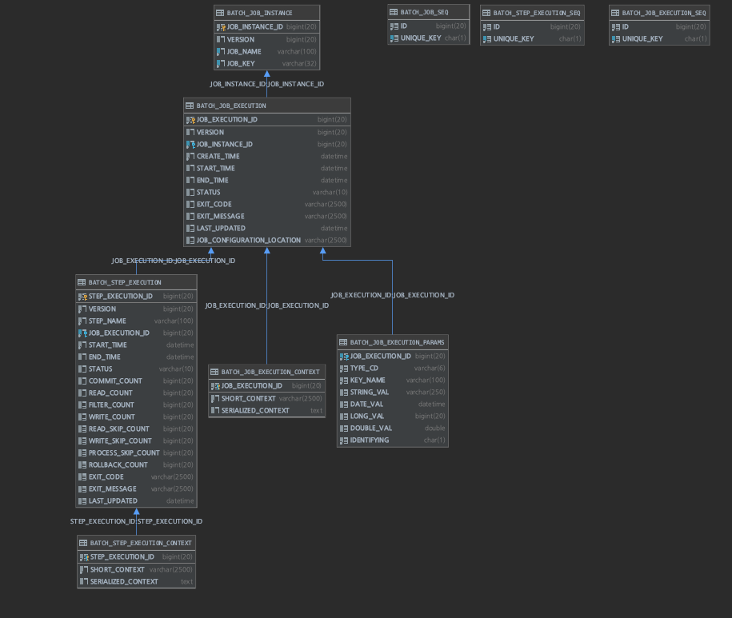

# SpringBatch Saturday Study

## 추가적 진행
- [x] txt 파일 reader 기능 추가 (csv, txt, excel)
- [x] excel Report 모듈 참고 구현
- [x] 배치 프로세스상에서 Step 간의 `데이터 공유`하는 방법 개선(외부 모듈 사용 X)
- [x] 속도를 줄이기 위해  Parallel Step or MultiThread로 구현해보기
- [x] JPA Querydsl를 활용하여 조인쿼리로 수정하기
- [x] JPA, Jdbc 속도 비교 (속도를 어느정도 포기하고 코드양을 줄일 것인지..?)
- [ ] 엘라스틱 서치 스택을 추가하여 배치와 연동

## 스터디
- 일자: 2020.08 ~ 11
- 장소: 홍대 입구역 스터디 룸
- 인원: N 명

## 배치 관련 업무 공유
1. 통계 테이블 구성 (파티셔닝)
2. 검색 데이터 통합 테이블
3. 정산
4. 데이터 집계

## 스터디 진행 방식
1. 스프링 이론
    1) [Spring.io](https://docs.spring.io/spring-batch/docs/current/reference/html/index.html)

2. 스프링 배치 실습 아이디어
    1) 도서관 데이터
        - '특정' 도서관 데이터 csv 기반 파일을 정규화된 테이블에 적재
    2) 미정

3. 스프링 배치 관리
    1) Retry 전략
    2) Jenkins 를 통한 schedule
    3) Transaction 처리 방법

4. 참고 사이트
    1) [기억보다 기록을](https://jojoldu.tistory.com/category/Spring%20Batch)
    2) [quartz](https://blog.kingbbode.com/posts/spring-batch-quartz)
    3) [Jenkins로 배치](https://jojoldu.tistory.com/313)
    4) [MyBatis 설정의 SpringBatch](http://mybatis.org/spring/ko/batch.html)
    5) [One Reader Multi Writer](https://www.javaer101.com/ko/article/5094462.html)

## 스터디 회의록
- [2020.08 ~ 11](docs/README.md)

## 스프링 배치 관리
- [Airflow](https://airbnb.io/projects/airflow/)
- [Apache Airflow](https://bcho.tistory.com/1184)
- [Spring Batch 관리 도구로서의 Jenkins](https://jojoldu.tistory.com/489)
- [Airflow VS Jenkins](https://dodonam.tistory.com/157)
- [Airflow를 이용한 데이터 Workflow 관리](https://www.slideshare.net/YoungHeonKim1/airflow-workflow)
- [Airflow 워크플로우 모니터링 플랫폼](https://118k.tistory.com/860)

## [프로젝트 Spec](build.gradle)
- SpringFramework
- Excel
- DBMS
- ORM Framework

## SpringBatch Schema ERD


### 해당 프로젝스 설정 시 db_mysql, db_oracle 내용
- MySQL
```yaml
spring:

  # JPA 설정
  jpa:
    database-platform: org.hibernate.dialect.MySQL5InnoDBDialect
#    generate-ddl: true
    show_sql: true
    properties:
      hibernate:
        format_sql: true
#        ddl-auto: update
        ddl-auto: none # 실행하지 않음
#       ddl-auto: create-drop
#        ddl-auto: create
#       ddl-auto: validate

  # MySQL DataSource
  datasource:
    # Spring Batch Schema MySQL
    batch:
      jdbc-url: jdbc:mysql://{ip}:{port}/{schema}
      username: {db_username}
      password: {db_password}
      driver-class-name: com.mysql.cj.jdbc.Driver
      sql-script-encoding: UTF-8

    # Domain DB
    domain:
      jdbc-url: jdbc:mysql://{ip}:{port}/{schema}
      username: 
      password: 
      driver-class-name: com.mysql.cj.jdbc.Driver
      sql-script-encoding: UTF-8
```

- Oracle
```yaml
spring:
  # JPA 설정
  jpa:
    database-platform: org.hibernate.dialect.Oracle10gDialect

  # Oracle DataSource
  datasource:
    # DB Tuning Schema
    oracle:
      jdbc-url: jdbc:oracle:thin:@//{ip}:{port}/{sid}
      username: {db_username}
      password: {db_password}
      driver-class-name: oracle.jdbc.OracleDriver
      sql-script-encoding: UTF-8
```
