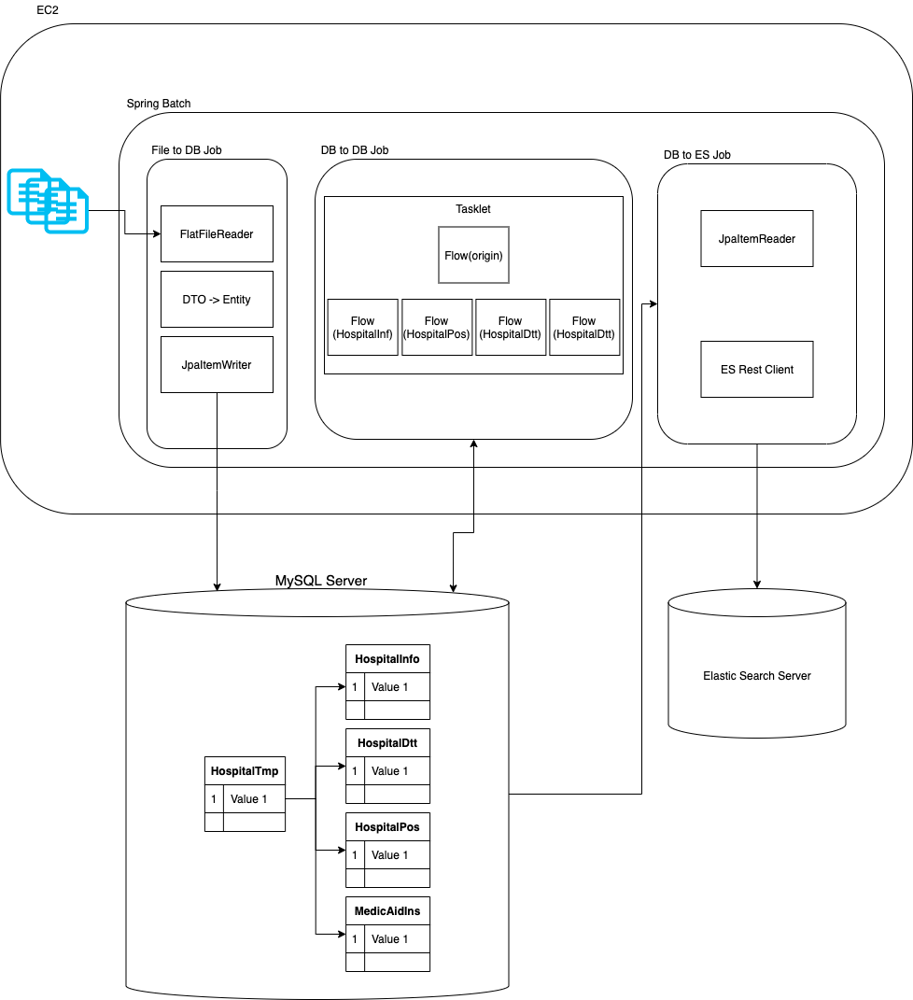

# 서울특별시 병의원 위치 정보 데이터 관리
- [서울 열린데이터 광장 - 서울특별시 병의원 위치 정보](http://data.seoul.go.kr/dataList/OA-20337/S/1/datasetView.do)

## 데이터 정보
- 공공데이터포털 전국 병의원 위치 찾기 api를 통해 서울특별시 병의원 위치 정보데이터를 받아 데이터 공개

- 필드 정보

|컬럼No|필드명(영문)|필드명(한글)|
|:---|:---|:---|
|1|HPID|기관ID|
|2|DUTYADDR|주소|
|3|DUTYDIV|병원분류|
|4|DUTYDIVNAM|병원분류명|
|5|DUTYEMCLS|응급의료기관코드|
|6|DUTYEMCLSNAME|응급의료기관코드명|
|7|DUTYERYN|응급실운영여부(1/2)|
|8|DUTYETC|비고|
|9|DUTYINF|기관설명상세|
|10|DUTYMAPIMG|간이약도|
|11|DUTYNAME|기관명|
|12|DUTYTEL1|대표전화1|
|13|DUTYTEL3|응급실전화|
|14|DUTYTIME1C|진료시간(월요일)C|
|15|DUTYTIME2C|진료시간(화요일)C|
|16|DUTYTIME3C|진료시간(수요일)C|
|17|DUTYTIME4C|진료시간(목요일)C|
|18|DUTYTIME5C|진료시간(금요일)C|
|19|DUTYTIME6C|진료시간(토요일)C|
|20|DUTYTIME7C|진료시간(일요일)C|
|21|DUTYTIME8C|진료시간(공휴일)C|
|22|DUTYTIME1S|진료시간(월요일)S|
|23|DUTYTIME2S|진료시간(화요일)S|
|24|DUTYTIME3S|진료시간(수요일)S|
|25|DUTYTIME4S|진료시간(목요일)S|
|26|DUTYTIME5S|진료시간(금요일)S|
|27|DUTYTIME6S|진료시간(토요일)S|
|28|DUTYTIME7S|진료시간(일요일)S|
|29|DUTYTIME8S|진료시간(공휴일)S|
|30|POSTCDN1|우편번호1|
|31|POSTCDN2|우편번호2|
|32|WGS84LON|병원경도|
|33|WGS84LAT|병원위도|
|34|WORK_DTTM작업시간|

## 데이터 관리
- 공공데이터에서 제공하는 데이터를 분석하여 사용할 수 있도록 스키마 재정의 및 재가공

## 배치 프로세스 작성
0. 파일 인코딩
   - 파일 인코딩 확인
      ```shell
      file -I seoul_hospital_position_info.csv
      ```
   - 파일 인코딩 변경
      ```shell
      iconv -f `{original_charset}` -t `utf-8` originalfile > newfile
      ```
1. 파일 데이터를 읽어 DTO에 저장
   - csv 파일의 필드정보를 갖는 DTO를 작성
   - 데이터 호출 시 `"(double quote)`삭제 필요 
   - 해당 DTO 클래스를 `refrect`를 통해 전체 `field`명 조회하는 `getFieldNames()` 작성
   - 파일에서 chunk 단위로 읽어와 저장한 `dto`의 데이터를 `entity`로 저장하는 `toEntity()` 메서드 작성

2. 임시 테이블을 필요한 중요 정보와 세부 정보로 구분하여 테이블관리
    - 기관 코드를 기준으로 병원 `기본정보`, `위치`, `시간`, `그 외` 필드로 분류하여 해당 테이블로 정의한다.
        - 병원기본정보: TB_HOSPITAL_INF
        - 병원위치정보: TB_HOSPITAL_POS
        - 병원시간정보: TB_HOSPITAL_DTT
        - 병원기관분류: TB_MEDIC_AID_INS

    - 전체 데이터를 읽어와 여러 테이블에 저장할 때 `멀티 스레드` 또는 `병렬 처리` 방식으로 개선할 수 있는지 생각하기
        - reader, writer가 thread-safe 한지 확인
        - `multi thread`를 통해 step 작업 시 `retry` 기능을 사용할 수 없는데 그래도 되는지
    
    - `Parallel Step` 활용한 처리 흐름 제어
        - Parallel을 이용하여 전체 병원정보를 읽어 DataShareBean이라는 ConcurrentHashMap 기반 빈에 넣는다.
        - 기본적으로 Step을 선형으로 실행하는 방식을 Flow를 이용하여 분리하여 DB 저장

    - 배치 시간 확인
        - 실행 환경
            - 운영체제: MacBook Pro
            - 프로세서: 2 GHz 쿼드 코어 Intel Core i5
            - 메모리:  16GB
        - `Serial Step` [프로세스](src/main/java/kr/seok/hospital/demo/Serial_H_DBToDBConfig.java)
            - step: 3m9s272ms
        - `Parallel Step` [프로세스](src/main/java/kr/seok/hospital/demo/Parallel_H_DbToDbConfig.java)
            - 데이터 조회
                - flow1: 967ms
            - 데이터 입력 (Parallel Process)
                - flow4: 1m11s965ms ~ 1m21s455ms
                - flow3: 1m13s480ms ~ 1m23s39ms
                - flow2: 1m15s271ms ~ 1m23s528ms
            - 최대 시간 (전체 건수 17,479)
                - 1m30s 이내

3. 여러 테이블로 정규화된 테이블의 데이터를 ES로 등록
    - 정규화된 데이터를 Querydsl을 통하여 [Q Type 클래스 생성](/src/main/java/kr/seok/hospital/domain/dto/HospitalEsEntity.java) 및 [조회 쿼리 작성](src/main/java/kr/seok/hospital/repository/querydsl/HospitalQuerydslRepositoryImpl.java)
    - `spring-data-elasticsearch`, `elasticsearch-rest-high-level-client` 라이브러리를 이용한 bulk API 호출로 시간을 줄여야 함
    - 위 `high-level-client`라이브러리 사용시 배치가 종료가 안되는 문제점이 있음
    - `spring-data-elasticsearch` 라이브러리 등록시 jpa 라이브러리와 충돌 문제 있음
    - 임시로 `ClosableHttpClient`를 사용하여 curl 요청, 입력 시간차이가 어마어마함 안쓰는 것만 못함

## 코드레벨 전체 아키텍처
- 특정 작업에 대한 `Job` Prototype 클래스 작성 후 `Step`으로 리펙토링
- 구현 방식 & 속도를 생각하면서 다양하게 구현할 것
- Entity 설계 시 `@Embedded` 필드 생성 생각하기
- [enum 타입 적용하기](docs/enum/README.md)
   - 테이블 마다 공통으로 사용하는 필드가 존재하는지?
   - 코드 변경하는 일이 빈번하지 않은 값
   - 단순 코드 테이블을 꼭 테이블에 가지고 있어야 하는지?
   - 그게 아닌 경우 `enum`으로 적용하기
- 복잡한 비즈니스 로직에 대한 쿼리는 Querydsl로 작성하되 [Custom](src/main/java/kr/seok/hospital/repository/querydsl/HospitalQuerydslRepositoryImpl.java) 클래스를 따로 작성
- ES에 데이터 등록용 DTO 작성, ES 어노테이션을 통한 데이터 명세화



## 개선 사항
- 배치 bulk 프로세스 
   - 속도 개선(Single Table Insert)
      - 상황
         - 파일을 읽는 속도는 FlatFileItemReader와 일반 BufferedReader 와의 속도차이는 미미
         - 파일을 쓰는 속도에서 차이가 발생하고 줄일 수 있는 것을 확인
         - 데이터의 PK가 이미 존재하기 때문에 `@GeneratedValue`를 사용하지 않는 상황
      - jpaItemWriter
         - 작동 방식
            - JpaItemWriter를 통한 `write()` 작업이 `merge()`를 기본 Mode로 구현
            - `usePersist(true)` 의 설정이 없는 경우 `merge()` 작동 방식으로 인하여 select(id 채번) -> insert(data 입력)로 수행
            - `usePersist(true)`이 설정되어 있는 경우 `persist()`로 작동하여 `select`를 생략, 바로 `insert()` 처리
            - `persist()`로 사용하는 경우 새로운 객체를 저장할 때만 사용해야함
         - 단점
            - 기본적으로 bulk insert를 수행하지 못함
            - auto-increment가 아닌 경우 batch insert 사용 가능
        
      - JdbcItemWriter
         - 연관관계가 들어가면 insert가 필요한 경우 직접 구현해야 하는 부분이 너무 많음
         - 컴파일체크, 타입, SQL 쿼리 문자열 문제 발생 가능
         - 속도가 비교적 빠름
      
      - Jdbc & Jpa (연관관계 작성시 해당 방법으로 처리예정)
         - OneToMany 연관관계 조회하는 경우, 부모 Entity를 조회하여 PK값을 저장
         - 부모 ID값으로 자식 Entity를 JdbcItemWriter로 batch insert 처리

   - [참고](https://jojoldu.tistory.com/507)
   
    - 속도 개선 2 (Multi Table Insert)
        - `Parallel Step`을 홣용한 각 테이블 별 Step 구성 및 병렬 처리
    
- Step 간 데이터 공유
   - StepExecution 을 사용하여 Batch Meta-data를 저장하면서 성능 이슈가 발생하여 StepExecution을 사용하지 않고 Step간 데이터 공유하는 방법
   - [싱글톤 빈](/src/main/java/kr/seok/HospitalApplication.java)을 하나 만들어 멤버 변수에 [Map](src/main/java/kr/seok/hospital/domain/dto/DataShareBean.java)을 두어 데이터를 공유하는 방식

   - [참고](https://wckhg89.github.io/archivers/springbatch3)

